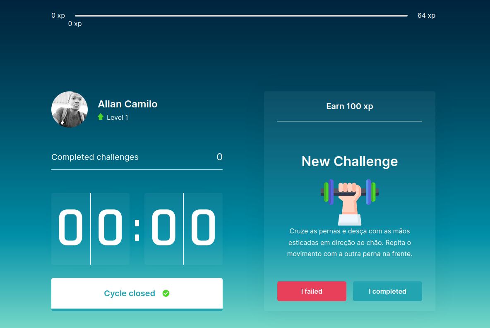
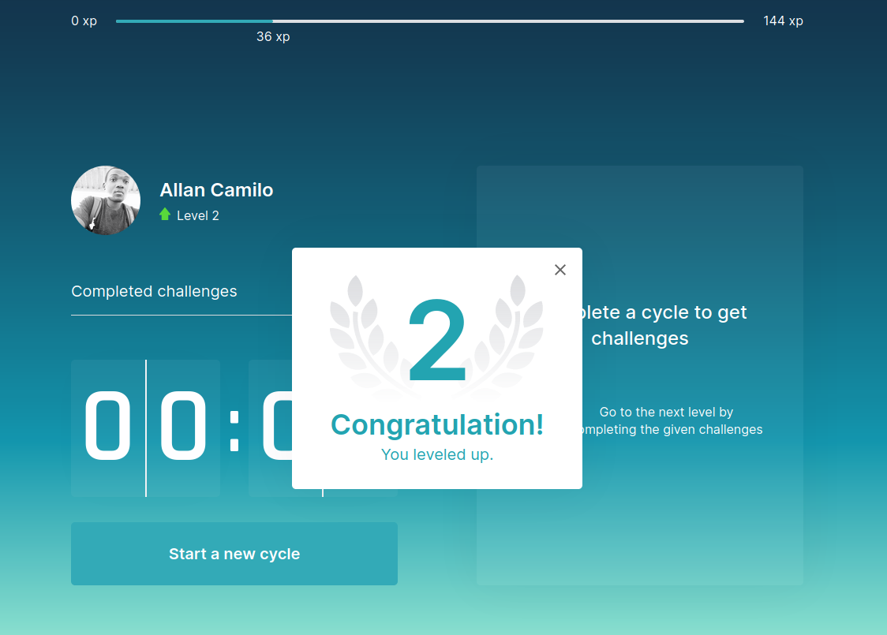

    
    

    <a href="#-idea">Idea</a>&nbsp;&nbsp;&nbsp;|&nbsp;&nbsp;&nbsp;
    <a href="#-techs">Techs</a>&nbsp;&nbsp;&nbsp;|&nbsp;&nbsp;&nbsp;
    <a href="#-layout">Layout</a>&nbsp;&nbsp;&nbsp;|&nbsp;&nbsp;&nbsp;
    <a href="https://github.com/allanShady/nlw4-moveit/blob/main/docs/README.md">TryOut</a>&nbsp;&nbsp;&nbsp;|&nbsp;&nbsp;&nbsp;
    <a href="#-roadmap">RoadMap</a>&nbsp;&nbsp;&nbsp;|&nbsp;&nbsp;&nbsp;
    <a href="#memo-licence">Licence</a>

 
  

## 💻 Idea

An application to remind **Developers** to practices health habits that count to their daily.

## 🚀 Techs

- [Environment setup](www.notion.so/Instala-o-das-ferramentas-1c09af201b4b49c5bf1678842a96d9ab)
- [Node.js](https://nodejs.org/en/)
- [React](https://reactjs.org) 
- [NextJS](https://nextjs.org/)
- [Cookies](https://github.com/js-cookie/js-cookie)
- [TypeScript](https://www.typescriptlang.org/)

## 🔖 Layout

Copy the figma layout using the links bellow. You may hava a [Figma](http://figma.com/) account.

- [Web Layout](https://www.figma.com/file/oi1MBHjuH3yIFknW59qfKo/Move.it-1.0)
- [Mobile Layout]()

## 🧘🏿‍ RoadMap

- [ ] Authentication
- [ ] PWA Support
- [ ] Dashboard
- [ ] Share achievements on social media
- [ ] Dark mode

> To more details please see the version 2 layout on figma
- [Features v2.0](https://www.figma.com/file/l8Zl7IYc5MzYdsumU469iT/Move.it-2.0-(Copy)?node-id=160%3A2761)

## :memo: Licence

This project is under MIT Licence. Please refer to [LICENSE](LICENSE.md) file for more details.

---

Build with 💜 by [**Alan Camilo**](https://allancamilo.com) and inspired by [**Rocketseat**](https://rocketseat.com.br/) 
